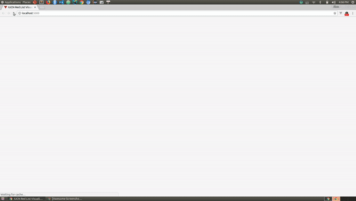

# IUCN Red List Visualization

A proj4 visulizes the species facing a risk of extinction and their stories.

<p align="center">
  <a href="https://52-hz-whale.github.io/IUCN_Red_List_Visualization/" target="_blank">
    
    <br>
    Live Demo
  </a>
</p>

## Features

- D3
  - Topojson help convert the GeoJson format to TopoJson.
  - D3-geo calculate the path and map to projection.
- Single-file Vue
  - Axios for HTTP request JSON file storing species' data.
  - Serve with hot reload
- Animation
  - Transition animation when switching species' views
  - D3-transition animation when first appearing text and tweening globe during switching species' views.
- Optimize Performance
  - Minify species' JPG images via [TinyPNG](tinypng.com)
  - Fixed position for animation chunks

## Build Setup

```bash
open directory
cd IUCN_Red_List_Visualization

# install dependencies
npm install

# serve with hot reload at localhost:5000
serve -c
```

## License

MIT