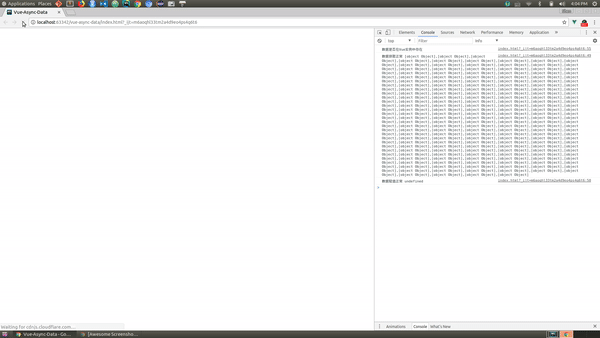

# Vue-Async-Data

Vue异步加载数据，完全加载成功后，再渲染页面的常规操作。

**Vue数据异步加载示例**：[Demo](https://52-hz-whale.github.io/vue-async-data)

- 在created/beforeCreate生命周期部分使用Axios异步加载；
- 返回数据赋值给Vue示例中对应的$data属性；
- computed中声明isLoaded方法监听$data是否赋值成功
- $data的对应属性成功接收数据后，isLoaded返回true, 再使用v-if/v-show="isLoaded"完成页面渲染。
